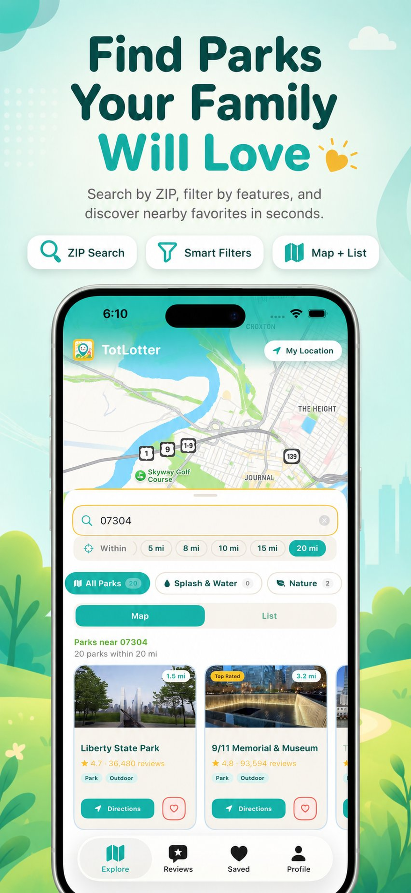
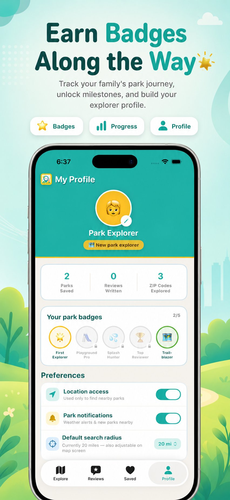
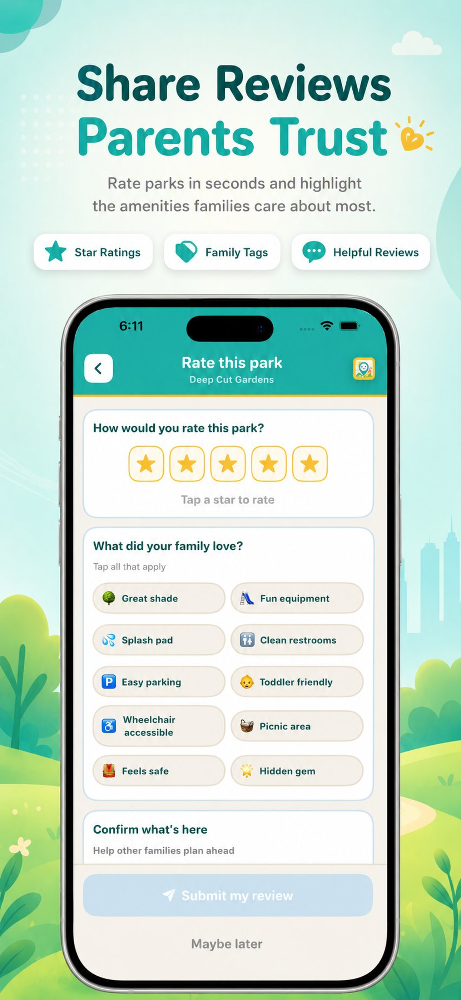
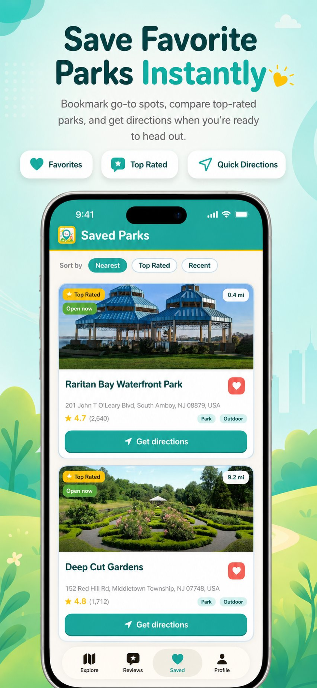

# TotLotter 🌳

A kid-friendly park and playground finder for parents and families,
built with SwiftUI and AI-assisted development using Claude.

Available on the App Store:
https://apps.apple.com/app/totlotter/id6768323304

---

## What It Does

TotLotter helps parents discover local parks, playgrounds, splash 
pads, and nature spots nearby. Users can:

- 🔍 Search for parks by location and radius
- 🎯 Filter by type: Playground, Splash & Water, Nature, Shade
- ❤️ Save favorite parks with UserDefaults persistence
- ⭐ Write and read park reviews
- 👤 Build a profile with emoji picker, badges, and live stats
- 📍 Use live location detection via LocationManager
- 
## Screenshots

  
  
  
  

---

## Tech Stack

| Technology | Usage |
|---|---|
| SwiftUI | UI framework |
| Xcode | Development environment |
| Google Places API (New) | Real park data and photos |
| AdMob (Google Mobile Ads SDK v11) | Banner ad monetization |
| StoreKit 2 | In-app purchases (tip jar) |
| UserDefaults | Local data persistence |
| CoreLocation | Device location services |
| Claude AI | AI-assisted development partner |

---

## Key Features Built

- Confidence-scoring filter system (splashPadScore, natureScore,
  playgroundScore, shadeScore) with minimum thresholds
- isNonParkVenue blocklist to filter irrelevant results
- SavedParksManager, ReviewsManager, LocationManager as shared
  singletons
- Banner ads after every 3rd card in HomeView and SavedParksView
- StoreKit 2 tip jar with three IAP products:
  Small ($0.99), Medium ($2.99), Large ($4.99)
- 180-point pre-submission audit completed before App Store upload

---

## App Store

- Version: 1.0.5
- Bundle ID: com.camilosinc.totlotter
- Age Rating: 4+
- App Store Link: https://apps.apple.com/app/totlotter/id6768323304

---

## Development Approach

This app was built using AI-assisted development — specifically
using Claude as a development partner for architecture decisions,
bug fixing, feature implementation, and the pre-submission audit.
This project demonstrates how non-traditional developers can
ship production-quality iOS apps by combining domain knowledge,
product thinking, and AI collaboration.

---

## Privacy Policy

https://www.iubenda.com/privacy-policy/69710755

---

## Developer

Limbert Camilo
https://iamldc.github.io
https://www.linkedin.com/in/limbert-camilo-6369bb194

---

## Note on API Keys

API keys and sensitive credentials have been removed from this
repository. To run this project locally, you will need to supply
your own:
- Google Places API Key
- AdMob App ID and Banner Ad Unit ID
